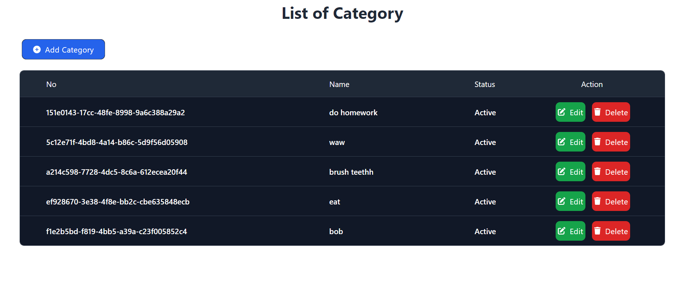

[](https://classroom.github.com/a/holP5FYg)
# W19-React-feature-Nofrialdi



## Link Preview

<https://w19-react-features-nofrialdi.vercel.app/login>

## How to Install

```bash
npm install
npm run dev #watch in dev mode
npm run build #for production purposes
```

## Tech Stack

[](https://skillicons.dev)
